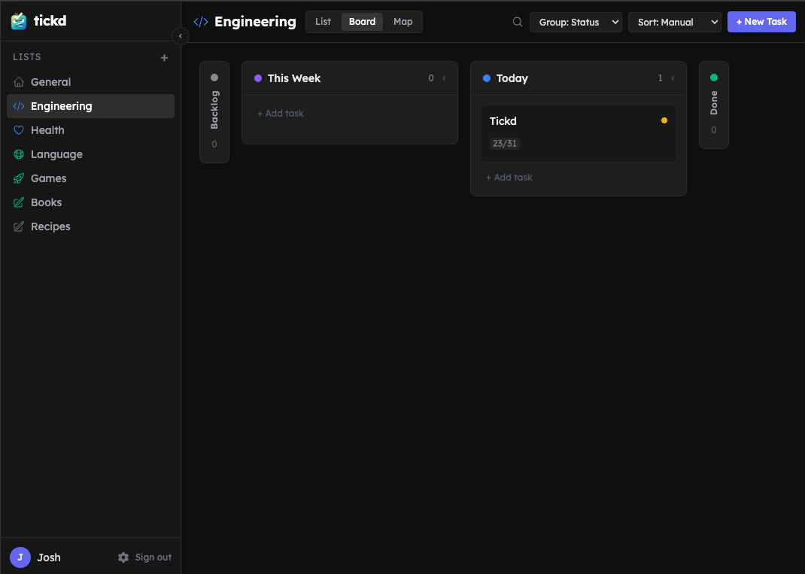

# tickd



A task management app that gets out of your way. Organize work into lists, visualize it as a board or mind map, and keep moving.

Built with SvelteKit, MongoDB, and a dark theme that doesn't hurt your eyes at 2am.

## Features

- **Three views** — List, Kanban board, and mind map. Switch anytime, state is preserved.
- **Rich tasks** — Priority, status, due dates, tags, subtasks, checklists, and a rich text description.
- **Custom statuses** — Define your own workflow stages. Statuses are global per user, not per list.
- **Quick capture** — Press `N` to create a task. Press `Cmd+K` to search across all lists.
- **Archiving** — Archive tasks or entire lists. One-click to archive all done tasks.
- **Drag to sort** — Reorder tasks and checklists by dragging.

## Tech Stack

| Layer | Tech |
|---|---|
| Framework | [SvelteKit 2](https://kit.svelte.dev) with Svelte 5 runes |
| Database | [MongoDB](https://www.mongodb.com) |
| Auth | [Lucia 3](https://lucia-auth.com) |
| Styling | [Tailwind CSS 3](https://tailwindcss.com) |
| Rich text | [Tiptap 2](https://tiptap.dev) |
| Mind map | [XYFlow](https://xyflow.com) |
| Deploy | [Vercel](https://vercel.com) |

## Getting Started

**Prerequisites:** Node.js 22+, MongoDB (local or Atlas)

```bash
# 1. Clone and install
git clone https://github.com/yourname/tickd.git
cd tickd
npm install

# 2. Configure environment
cp .env.example .env
# Edit .env and set MONGODB_URI

# 3. Start MongoDB locally (optional, requires Docker)
docker-compose up -d

# 4. Run the dev server
npm run dev
```

Open [http://localhost:5173](http://localhost:5173), register an account, and start ticking.

## Environment Variables

| Variable | Required | Description |
|---|---|---|
| `MONGODB_URI` | Yes | MongoDB connection string (e.g. `mongodb://localhost:27017/tickd` or an Atlas URI) |

## Scripts

```bash
npm run dev        # Development server
npm run build      # Production build
npm run preview    # Preview production build locally
npm run check      # TypeScript + Svelte type checking
```

## Project Structure

```
src/
├── routes/
│   ├── (app)/              # Protected routes (requires auth)
│   │   ├── +layout.svelte  # App shell: sidebar, search, settings
│   │   └── [listId]/       # Task list view
│   ├── api/                # REST endpoints (tasks, lists, tags, settings)
│   └── auth/               # Login, register, logout
└── lib/
    ├── components/         # Svelte components
    ├── server/             # DB connection, auth, collections
    ├── stores/             # UI state (view mode, sidebar)
    └── types.ts            # Shared TypeScript interfaces
```

## Keyboard Shortcuts

| Shortcut | Action |
|---|---|
| `N` | New task |
| `Cmd/Ctrl+K` | Search all tasks |
| `Esc` | Close modal |

## Deploying to Vercel

The project uses `@sveltejs/adapter-vercel` and deploys out of the box.

```bash
npm run build
vercel deploy
```

Set `MONGODB_URI` in your Vercel project's environment variables.
